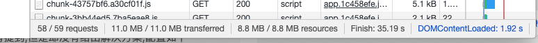
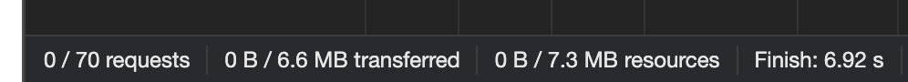

# vue-cli3+BootstrapVue项目搭建

## 介绍

我司App的官网，使用 vue-cli3 + bootstrapVue 搭建而成，项目本身有对例如 axios 做了简易封装。有需拿去作参考的童鞋自取~

## 技术栈

-  [Vue2](https://cn.vuejs.org/)、[Vue-Router](https://router.vuejs.org/zh/)、[Vuex](https://vuex.vuejs.org/zh/) 三件套
-  [Bootstrap-Vue](https://github.com/bootstrap-vue/bootstrap-vue) 响应式页面搭建
-  [Axios](https://github.com/axios/axios) 网络请求
-  [Vue-Progressbar](https://github.com/hilongjw/vue-progressbar) 网页加载进度条
-  [Vue-Toasted](https://github.com/shakee93/vue-toasted) 弹窗提醒
-  [Vue-Amap](https://github.com/ElemeFE/vue-amap) 高德地图
-  [Async-Validator](https://github.com/yiminghe/async-validator) 表单异步验证

## 使用

下载项目到本地后执行安装依赖

```shell
npm install
```

### 本地运行并实时预览

```shell
npm run serve
```

### 生产环境打包

```shell
npm run build
```

## 性能优化

### 利用 import() 异步引入组件实现按需引入

```js
function loadView(component) {
  // [request]表示实际解析的文件名
  return () => import(/* webpackChunkName: "[request]" */ `views/${component}`)
}
```

### 打包分析图

```shell
npm install webpack-bundle-analyzer --save-dev
```

`vue.config.js` 中配置：

```js
module.exports = {
  chainWebpack: (config) => {
    config
      .plugin('webpack-bundle-analyzer')
      .use(require('webpack-bundle-analyzer').BundleAnalyzerPlugin)
  },
}
```

运行 `npm run serve` 即弹出报告图。

P.S. 想要看生产环境下的最终打包分析图，可执行：

```shell
npm run build:report
```

报告会生成在 `dist` 目录下，名为 `report.html`

### externals 提取依赖包（示例）

仅为示例，本项目在提取时不分dev和build，全部统统走cdn。

```js
// cdn预加载使用
const externals = {
  vue: "Vue",
  "vue-router": "VueRouter",
  vuex: "Vuex",
  axios: "axios",
  jquery: "jQuery",
  'AMap': 'AMap' // 高德地图配置
};

const cdn = {
  // 开发环境
  dev: {
    css: [
      // "https://unpkg.com/element-ui/lib/theme-chalk/index.css",
      // "https://cdn.bootcss.com/nprogress/0.2.0/nprogress.min.css",
    ],
    js: ["https://at.alicdn.com/t/font_2002270_irvdc1go0fn.js"],
  },
  // 生产环境
  build: {
    css: [
      "https://cdn.bootcdn.net/ajax/libs/twitter-bootstrap/4.5.2/css/bootstrap.min.css",
      "https://cdn.bootcdn.net/ajax/libs/bootstrap-vue/2.16.0/bootstrap-vue.min.css",
    ],
    js: [
      "https://polyfill.io/v3/polyfill.min.js?features=es2015%2CIntersectionObserver", // 兼容旧浏览器
      "https://at.alicdn.com/t/font_2002270_irvdc1go0fn.js", // iconfont字体图标
      "https://cdn.bootcdn.net/ajax/libs/vue/2.6.11/vue.runtime.min.js",
      "https://cdn.bootcdn.net/ajax/libs/bootstrap-vue/2.6.1/bootstrap-vue.min.js",
      "https://cdn.bootcdn.net/ajax/libs/vue-router/3.2.0/vue-router.min.js",
      "https://cdn.bootcdn.net/ajax/libs/vuex/3.2.0/vuex.min.js",
      "https://cdn.bootcdn.net/ajax/libs/axios/0.19.2/axios.min.js",
      "https://cdn.bootcdn.net/ajax/libs/jquery/3.5.1/jquery.slim.min.js",
      "http://webapi.amap.com/maps?v=1.4.4&key='d5b8ac92271c1c9785b384c9b83ce8b5'"
    ],
  },
};

module.exports = {
  chainWebpack: (config) => {
    config.plugin("html").tap((args) => {
      if (prodEnv) {
        args[0].cdn = cdn.build;
      }
      if (!prodEnv) {
        args[0].cdn = cdn.build;
      }
      return args;
    });
  },
};
```

`index.html` 中引入 cdn ：

```html
<!DOCTYPE html>
<html lang="en">
  <head>
    <meta charset="utf-8">
    <meta http-equiv="X-UA-Compatible" content="IE=edge">
    <meta name="viewport" content="width=device-width, initial-scale=1, shrink-to-fit=no">
    <link rel="icon" href="<%= BASE_URL %>favicon.ico">
    <title><%= htmlWebpackPlugin.options.title %></title>

    <!-- 使用CDN加速的CSS文件，配置在vue.config.js下 -->
    <% for (var i in htmlWebpackPlugin.options.cdn && htmlWebpackPlugin.options.cdn.css) { %>
    <link href="<%= htmlWebpackPlugin.options.cdn.css[i] %>" rel="preload" as="style">
    <link href="<%= htmlWebpackPlugin.options.cdn.css[i] %>" rel="stylesheet">
    <% } %>
  </head>
  <body>
    <noscript>
      <strong>We're sorry but <%= htmlWebpackPlugin.options.title %> doesn't work properly without JavaScript enabled. Please enable it to continue.</strong>
    </noscript>
    <div id="app"></div>
    <!-- 使用CDN加速的JS文件，配置在vue.config.js下 -->
    <% for (var i in htmlWebpackPlugin.options.cdn && htmlWebpackPlugin.options.cdn.js) { %>
    <script src="<%= htmlWebpackPlugin.options.cdn.js[i] %>"></script>
    <% } %>
  </body>
</html>
```

### 图片压缩

安装：

```shell
npm install image-webpack-loader --save-dev
```

`vue.config.js` 中配置：

```js
module.exports = {
  chainWebpack: (config) => {
    config.module
      .rule('images')
      .use('imageWebpackLoader')
      .loader('image-webpack-loader')
  },
}
```

### 优化前后对比





